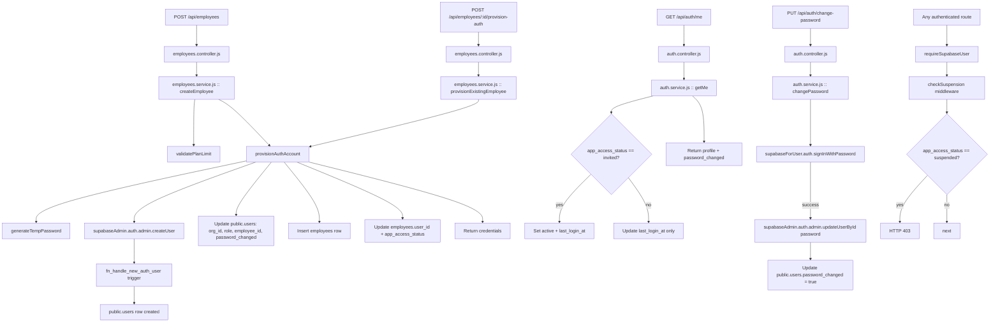

# Design Document: Employee Auth Provisioning

## Overview

Every employee created via `POST /api/employees` now automatically receives a Supabase Auth account. The owner gets back a `credentials` object (`{ email, temporaryPassword }`) to share with the employee. Credentials are also stored in an `employee_credentials` table (with the password hashed) so the owner can retrieve them later if needed. On first login the employee's `app_access_status` transitions from `invited` → `active`, and they are forced to change their temporary password before accessing any other feature.

The design introduces:
- A shared `provisionAuthAccount(employee, orgId)` service function used by both creation-time and on-demand provisioning
- An `employee_credentials` table to store retrievable credentials (email + bcrypt-hashed password)
- A `GET /api/employees/:id/credentials` endpoint so owners can retrieve credentials later
- A `POST /api/employees/:id/provision-auth` endpoint for back-filling existing employees
- `GET /api/auth/me` — returns the employee profile + `password_changed`, activates `app_access_status`
- `PUT /api/auth/change-password` — verifies current password, sets `password_changed = true`
- A `checkSuspension` middleware that blocks suspended employees on every authenticated route
- A `password_changed` column on `public.users`
- Suspension flow that bans the Supabase Auth user on termination

### Key Design Decisions

**Email is always required.** Since every employee gets an auth account, `email` is a required field on `POST /api/employees`. This is validated before any DB write.

**Credentials stored for retrieval — password hashed with bcrypt.** The plain-text password is returned once in the API response. A separate `employee_credentials` table stores the `email` and a bcrypt hash of the temporary password so the owner can retrieve the email and reset credentials later. The plain-text password is never stored. When the employee changes their password, `is_active` on the credentials row is set to `false` (the credential is no longer valid).

**Email uniqueness checked before employee insert.** To avoid creating an orphaned `employees` row when the email is already taken, the provisioner calls `supabaseAdmin.auth.admin.createUser()` first, and only inserts the `employees` row after confirming the auth account was created.

**`provisionAuthAccount` is a shared, atomic function.** Both `createEmployee` and the on-demand endpoint call the same function. It owns the full lifecycle: create auth user → update `public.users` → update `employees.user_id` → store credentials → rollback on any failure.

**Rollback on partial failure.** If any step after `createUser` fails, the provisioner calls `deleteUser` to avoid orphaned auth accounts. If `deleteUser` also fails, a structured log entry is emitted for manual cleanup.

**`checkSuspension` runs after `requireSupabaseUser`.** Supabase's `ban_duration` prevents new token issuance, but existing short-lived tokens may still be valid for a brief window. The middleware provides an immediate application-layer block.

---

## Architecture



---

## Components and Interfaces

### 1. `provisionAuthAccount(employee, orgId)` — `src/services/employees.service.js`

The core provisioning function. Called by both `createEmployee` and `provisionExistingEmployee`.

```
Input:
  employee: {
    id: UUID,
    full_name: string,
    phone: string,       // used to derive temp password
    email: string,       // required
  }
  orgId: UUID

Output (success):
  { authUserId: UUID, email: string, temporaryPassword: string }

Throws:
  EmailConflictError    — email already exists in auth.users (HTTP 409)
  ProvisionError        — any other provisioning failure (HTTP 500)
```

**Steps:**

1. Call `generateTempPassword(employee.phone)` → `temporaryPassword`
2. Call `supabaseAdmin.auth.admin.createUser({ email, password: temporaryPassword, email_confirm: true, user_metadata: { full_name, org_id: orgId, role: 'employee' } })`
   - On duplicate email error → throw `EmailConflictError`
   - On other error → throw `ProvisionError`
3. `authUserId` = created user's UUID
4. Update `public.users` row (created by trigger): `{ org_id: orgId, role: 'employee', employee_id: employee.id, password_changed: false }`
   - On failure → rollback (step 6), throw `ProvisionError`
5. Update `employees`: `{ user_id: authUserId, app_access_status: 'invited' }`
   - On failure → rollback (step 6), throw `ProvisionError`
6. **Rollback**: call `supabaseAdmin.auth.admin.deleteUser(authUserId)`
   - If rollback also fails → emit structured log `{ event: 'auth_provision_rollback_failed', orphaned_auth_user_id: authUserId, employee_id: employee.id, org_id: orgId, timestamp }`
7. Emit success log: `{ event: 'auth_provisioned', employee_id, auth_user_id: authUserId, org_id: orgId, email_domain: email.split('@')[1], timestamp }`
8. Return `{ authUserId, email, temporaryPassword }`

### 2. `generateTempPassword(phone)` — `src/services/employees.service.js`

```
Input:  phone: string  (any format, e.g. "+977-9841234567" or "9841234567")
Output: string         e.g. "Hajir@12344567"

Algorithm:
  last4 = phone.replace(/\D/g, '').slice(-4)   // strip non-digits, take last 4
  rand  = Math.floor(Math.random() * 9000) + 1000  // 1000–9999
  return `Hajir@${last4}${rand}`
```

Result is always 14 characters (`Hajir@` = 6 + 4 + 4), well above Supabase's 6-character minimum.

### 3. `createEmployee(userId, body)` — updated flow

```
1. resolveOrgId(userId)
2. validatePlanLimit(orgId)
3. Validate required fields: full_name, phone, email, join_date_bs, join_date_ad, basic_salary
4. provisionAuthAccount({ id: <pending>, full_name, phone, email }, orgId)
   — email conflict → HTTP 409 (no employees row created)
   — other error   → HTTP 500
5. Insert employees row with user_id = authUserId, app_access_status = 'invited'
6. Update public.users.employee_id = employee.id  (back-fill)
7. initializeLeaveBalances(orgId, employee.id, bsYear)
8. Return { data: employee, credentials: { email, temporaryPassword } }
```

> **Note on ordering:** `provisionAuthAccount` is called before the `employees` insert. This ensures that if the email is already taken, no `employees` row is created (Requirement 4.2). The `employee.id` is not yet known at step 4, so the trigger-created `public.users` row gets `employee_id` back-filled in step 6 after the insert.

### 4. `provisionExistingEmployee(userId, employeeId, email)` — `src/services/employees.service.js`

New function for `POST /api/employees/:id/provision-auth`.

```
1. resolveOrgId(userId)
2. assertEmployeeOwnership(employeeId, orgId) → employee
3. If employee.user_id is set → throw HTTP 409 "This employee already has an auth account"
4. If employee.status === 'terminated' → throw HTTP 422 "Cannot provision access for a terminated employee"
5. If employee.app_access_status === 'suspended' (and not terminated):
   a. Call supabaseAdmin.auth.admin.updateUserById(employee.user_id, { ban_duration: '0' })
6. Call provisionAuthAccount({ id: employeeId, full_name: employee.full_name, phone: employee.phone, email }, orgId)
7. Return { data: { email, temporaryPassword } }
```

### 5. `GET /api/auth/me` — `src/services/auth.service.js`

```
1. Look up public.users by req.user.id → { org_id, employee_id, password_changed }
2. Look up employees by employee_id → full profile including app_access_status
3. If app_access_status === 'invited':
   a. Update employees.app_access_status = 'active'
   b. Update public.users.last_login_at = NOW()
4. If app_access_status === 'active':
   a. Update public.users.last_login_at = NOW()
5. Return { data: { ...employeeProfile, password_changed } }
```

### 6. `PUT /api/auth/change-password` — `src/services/auth.service.js`

```
Input: { currentPassword: string, newPassword: string }

1. Validate newPassword.length >= 8 → HTTP 422 if not
2. Call supabaseForUser(req.accessToken).auth.signInWithPassword({ email: req.user.email, password: currentPassword })
   → HTTP 401 "Current password is incorrect" on failure
3. Call supabaseAdmin.auth.admin.updateUserById(req.user.id, { password: newPassword })
4. Update public.users SET password_changed = true WHERE id = req.user.id
5. Return HTTP 200 { message: "Password changed successfully" }
```

### 7. `checkSuspension` middleware — `src/middleware/checkSuspension.js`

New middleware, applied after `requireSupabaseUser` on all employee-facing routes.

```javascript
async function checkSuspension(req, res, next) {
  const { data: emp } = await supabaseAdmin
    .from('employees')
    .select('app_access_status')
    .eq('user_id', req.user.id)
    .maybeSingle();

  if (emp?.app_access_status === 'suspended') {
    return res.status(403).json({
      error: 'Your account access has been suspended. Contact your organization admin.'
    });
  }
  return next();
}
```

Applied on routes that employees call (attendance, leaves, `GET /api/auth/me`, `PUT /api/auth/change-password`). Owner/HR routes do not need this middleware since owners/HR are not employees.

### 8. `GET /api/employees/:id/credentials` — owner/HR only

Retrieves stored credential info for an employee. Returns email and active status — **never** the plain-text password.

```
1. resolveOrgId(userId)
2. assertEmployeeOwnership(employeeId, orgId)
3. Query employee_credentials WHERE employee_id = employeeId AND org_id = orgId
   ORDER BY created_at DESC LIMIT 1
4. If no row → return 404 "No credentials found for this employee"
5. Return { employee_id, email, is_active, provisioned_at: created_at }
```

### 9. `deactivateEmployee` — updated suspension flow

When termination is called, after setting `status = 'terminated'` and `app_access_status = 'suspended'`:

```javascript
if (employee.user_id) {
  await supabaseAdmin.auth.admin.updateUserById(employee.user_id, {
    ban_duration: 'none'   // Supabase: 'none' = permanent ban
  });
}
```

---

## Data Models

### New Table: `employee_credentials`

Stores retrievable credentials per employee. The password is bcrypt-hashed — the plain-text is never stored.

```sql
CREATE TABLE IF NOT EXISTS public.employee_credentials (
  id            UUID        PRIMARY KEY DEFAULT uuid_generate_v4(),
  org_id        UUID        NOT NULL REFERENCES public.organizations(id) ON DELETE CASCADE,
  employee_id   UUID        NOT NULL REFERENCES public.employees(id) ON DELETE CASCADE,
  email         TEXT        NOT NULL,
  password_hash TEXT        NOT NULL,   -- bcrypt hash of temporaryPassword
  is_active     BOOLEAN     NOT NULL DEFAULT TRUE,
  -- is_active = false once employee changes their password
  provisioned_by UUID       REFERENCES public.users(id),
  created_at    TIMESTAMPTZ NOT NULL DEFAULT NOW(),
  updated_at    TIMESTAMPTZ NOT NULL DEFAULT NOW()
);

CREATE INDEX IF NOT EXISTS idx_emp_creds_employee ON public.employee_credentials(employee_id);
CREATE INDEX IF NOT EXISTS idx_emp_creds_org      ON public.employee_credentials(org_id);
```

**What is stored vs what is not:**

| Field | Stored | Notes |
|---|---|---|
| `email` | ✅ Plain text | Owner needs to see this |
| `temporaryPassword` | ❌ Never | Plain text never persisted |
| `password_hash` | ✅ bcrypt hash | For owner to verify if needed; cannot be reversed |
| `is_active` | ✅ | Set to `false` when employee changes password |

**`GET /api/employees/:id/credentials` response:**
```json
{
  "data": {
    "employee_id": "uuid",
    "email": "ram@example.com",
    "is_active": true,
    "provisioned_at": "2026-05-04T10:00:00Z",
    "note": "Password has been changed by employee"  // only when is_active = false
  }
}
```
> The plain-text password is **never** returned from this endpoint — only the email and whether the credential is still active (i.e. whether the employee has changed their password yet).

### Schema Migration: `public.users`

```sql
ALTER TABLE public.users
  ADD COLUMN IF NOT EXISTS password_changed BOOLEAN NOT NULL DEFAULT FALSE;
```

### `public.employees` — no new columns

The existing columns cover all new state:
- `user_id UUID REFERENCES public.users(id) ON DELETE SET NULL` — set after provisioning
- `app_access_status TEXT CHECK (... 'not_invited','invited','active','suspended')` — tracks lifecycle

### Updated field: `app_access_status` lifecycle

```
not_invited  →  invited   (after provisionAuthAccount succeeds)
invited      →  active    (on first GET /api/auth/me call)
active       →  suspended (on termination or disciplinary action)
suspended    →  invited   (on re-provisioning for non-terminated employee)
```

### `public.users` — relevant fields

| Column | Type | Notes |
|---|---|---|
| `id` | UUID | FK to `auth.users` |
| `org_id` | UUID | Set by provisioner after trigger creates the row |
| `role` | TEXT | Set to `'employee'` by provisioner |
| `employee_id` | UUID | Back-filled after `employees` insert |
| `password_changed` | BOOLEAN | New column. `false` until `PUT /api/auth/change-password` succeeds |
| `last_login_at` | TIMESTAMPTZ | Updated on every `GET /api/auth/me` call |
| `is_active` | BOOLEAN | Existing field; not used for suspension (we use `app_access_status`) |

### Credentials Response Shape

**On create / provision (one-time plain-text):**
```json
{
  "data": { /* full employee record */ },
  "credentials": {
    "email": "employee@example.com",
    "temporaryPassword": "Hajir@12344567"
  }
}
```

**On retrieve (`GET /api/employees/:id/credentials`):**
```json
{
  "data": {
    "employee_id": "uuid",
    "email": "employee@example.com",
    "is_active": true,
    "provisioned_at": "2026-05-04T10:00:00Z"
  }
}
```

The plain-text `temporaryPassword` is only ever present in the create/provision response. It is never stored, never logged, and never returned from the retrieve endpoint.

---

## Correctness Properties

*A property is a characteristic or behavior that should hold true across all valid executions of a system — essentially, a formal statement about what the system should do. Properties serve as the bridge between human-readable specifications and machine-verifiable correctness guarantees.*

### Property Reflection

Before writing properties, I reviewed the prework for redundancy:

- Properties 1.2, 1.4, 1.5, 5.1, 5.2 all test aspects of `provisionAuthAccount` succeeding. They can be combined into one comprehensive "provisioning creates correct state" property.
- Properties 3.1 and 3.2 both test rollback on post-createUser failure at different steps. They can be combined into one "any post-createUser failure triggers rollback" property.
- Properties 4.1 and 5.5 are identical (duplicate email → 409). Merged into one.
- Properties 6.2 and 6.3 are complementary (invited→active vs active stays active). Kept separate as they test different transitions.
- Properties 7.1 and 7.2 are both about the change-password success path. Combined into one.
- Properties 10.1 and 10.4 can be combined: success log contains required fields AND does not contain sensitive data.

After reflection, the consolidated property list is:

---

### Property 1: Provisioning creates correct linked state

*For any* valid employee payload with a unique email, calling `provisionAuthAccount` must result in: (a) `supabaseAdmin.auth.admin.createUser` called with `email_confirm: true` and `raw_user_meta_data` containing `full_name`, `org_id`, and `role: 'employee'`; (b) `public.users` updated with `org_id`, `role = 'employee'`, `employee_id`, and `password_changed = false`; (c) `employees.user_id` set to the new auth UUID and `app_access_status = 'invited'`; (d) the returned credentials contain the same `email` as the input and a non-empty `temporaryPassword`.

**Validates: Requirements 1.2, 1.3, 1.4, 1.5, 1.6, 5.1, 5.2**

---

### Property 2: Email required — no email means rejection

*For any* employee creation payload that is missing the `email` field (or has `email = null`), `createEmployee` must return HTTP 422 with the message `"Email is required to create an employee account"` and must not insert any row into `employees`.

**Validates: Requirements 1.1**

---

### Property 3: Temporary password format invariant

*For any* phone number string, `generateTempPassword(phone)` must return a string that: (a) matches the pattern `/^Hajir@\d{4}\d{4}$/`; (b) has its first 4 digits after `@` equal to the last 4 digits of the phone's digit-only representation; (c) has length ≥ 6.

**Validates: Requirements 2.1, 2.4**

---

### Property 4: Temporary password never persisted or logged

*For any* provisioning call (success or failure), no call to any DB write function and no call to the logger must contain the plain-text `temporaryPassword` value.

**Validates: Requirements 2.2, 2.3, 10.4**

---

### Property 5: Post-createUser failure always triggers rollback

*For any* provisioning attempt where `supabaseAdmin.auth.admin.createUser` succeeds but any subsequent step fails (either the `public.users` update or the `employees.user_id` update), `supabaseAdmin.auth.admin.deleteUser` must be called with the newly created auth user's UUID.

**Validates: Requirements 3.1, 3.2**

---

### Property 6: Data integrity — no dangling user_id

*For any* provisioning outcome (success or failure with rollback), `employees.user_id` must either be `null` or point to a UUID that exists in `public.users`. The provisioner must never leave `employees.user_id` set to a UUID that has no corresponding `public.users` row.

**Validates: Requirements 3.5**

---

### Property 7: Duplicate email always rejected before employee insert

*For any* provisioning call where `supabaseAdmin.auth.admin.createUser` returns a duplicate-email error, the `employees` table insert must never be called, and the response must be HTTP 409 with the message `"An account with this email already exists. Use a different email for this employee."`.

**Validates: Requirements 4.1, 4.2, 5.5**

---

### Property 8: Guard conditions on provision-auth endpoint

*For any* employee whose `user_id` is already set, `provisionExistingEmployee` must return HTTP 409. *For any* employee whose `status` is `'terminated'`, `provisionExistingEmployee` must return HTTP 422. These guards must hold regardless of the email provided.

**Validates: Requirements 5.3, 5.4**

---

### Property 9: First login activates app_access_status

*For any* employee with `app_access_status = 'invited'`, calling `getMe` must transition `app_access_status` to `'active'` and set `last_login_at` to a non-null timestamp. *For any* employee with `app_access_status = 'active'`, calling `getMe` must leave `app_access_status` unchanged and update `last_login_at`.

**Validates: Requirements 6.1, 6.2, 6.3**

---

### Property 10: getMe response always includes password_changed

*For any* authenticated employee, the response from `getMe` must include a `password_changed` field whose value matches the stored value in `public.users`.

**Validates: Requirements 6.4**

---

### Property 11: Password change success sets password_changed = true

*For any* employee who successfully calls `changePassword` with a correct `currentPassword` and a `newPassword` of length ≥ 8, `public.users.password_changed` must be updated to `true`.

**Validates: Requirements 7.1, 7.2**

---

### Property 12: Short new password always rejected

*For any* `newPassword` string with length < 8, `changePassword` must return HTTP 422 with the message `"Password must be at least 8 characters"` without calling `supabaseAdmin.auth.admin.updateUserById`.

**Validates: Requirements 7.4**

---

### Property 13: Termination always suspends and bans

*For any* employee with a non-null `user_id`, calling `deactivateEmployee` must: (a) set `app_access_status = 'suspended'`; (b) call `supabaseAdmin.auth.admin.updateUserById(user_id, { ban_duration: 'none' })`.

**Validates: Requirements 8.1, 8.2**

---

### Property 14: Suspended employees blocked on all authenticated routes

*For any* request where the authenticated user's linked employee has `app_access_status = 'suspended'`, the `checkSuspension` middleware must return HTTP 403 with the message `"Your account access has been suspended. Contact your organization admin."` before the route handler is called.

**Validates: Requirements 8.3**

---

### Property 15: Provisioning success log contains required fields and no sensitive data

*For any* successful provisioning call, the logger must be called with an object containing `event: 'auth_provisioned'`, `employee_id`, `auth_user_id`, `org_id`, and a `timestamp`. The logged `email` field must contain only the domain portion (after `@`), not the full address. No log call must contain the plain-text password.

**Validates: Requirements 10.1, 10.4**

---

## Error Handling

### Error Classification

| Scenario | HTTP Status | Message |
|---|---|---|
| Missing email on create | 422 | `"Email is required to create an employee account"` |
| Duplicate email in auth.users | 409 | `"An account with this email already exists. Use a different email for this employee."` |
| Employee already provisioned | 409 | `"This employee already has an auth account"` |
| Terminated employee provision attempt | 422 | `"Cannot provision access for a terminated employee"` |
| Provisioning failure with rollback | 500 | `"Employee created but auth provisioning failed. Please contact support."` + `{ employee_id }` |
| Incorrect current password | 401 | `"Current password is incorrect"` |
| New password too short | 422 | `"Password must be at least 8 characters"` |
| Suspended employee access | 403 | `"Your account access has been suspended. Contact your organization admin."` |

### Rollback Log Entry (structured)

```json
{
  "event": "auth_provision_rollback_failed",
  "orphaned_auth_user_id": "<uuid>",
  "employee_id": "<uuid>",
  "org_id": "<uuid>",
  "timestamp": "2024-01-01T00:00:00.000Z"
}
```

### Sensitive Data Masking

All log entries related to provisioning must:
- Use `email.split('@')[1]` (domain only) instead of the full email
- Never include `temporaryPassword` — omit the field entirely
- Never include Supabase session tokens

---

## Testing Strategy

### Unit Tests (example-based)

Focus on specific scenarios and error conditions:

- `generateTempPassword`: correct format for various phone formats (with country code, with dashes, digits only)
- `createEmployee`: rejects missing email with 422
- `provisionAuthAccount`: rollback log entry shape when both `createUser` succeeds and `deleteUser` fails
- `changePassword`: returns 200 with correct message on success
- `checkSuspension`: passes through non-suspended employees, blocks suspended ones
- `deactivateEmployee`: does not call `updateUserById` when `user_id` is null

### Property-Based Tests

Using [fast-check](https://github.com/dubzzz/fast-check) (JavaScript PBT library). Each test runs a minimum of 100 iterations.

**Tag format:** `// Feature: employee-auth-provisioning, Property {N}: {property_text}`

| Property | Test Description | Generators |
|---|---|---|
| P1 | Provisioning creates correct linked state | `fc.record({ full_name: fc.string(), phone: fc.string({ minLength: 10 }), email: fc.emailAddress() })` |
| P2 | Email required — no email means rejection | `fc.record({ full_name: fc.string(), phone: fc.string() })` (no email field) |
| P3 | Temp password format invariant | `fc.string({ minLength: 4 })` as phone |
| P4 | Temp password never persisted or logged | `fc.record({ ... })` with logger spy |
| P5 | Post-createUser failure triggers rollback | `fc.record({ ... })` with injected failure at step 2 or 3 |
| P6 | No dangling user_id | Various failure injection scenarios |
| P7 | Duplicate email rejected before insert | `fc.emailAddress()` with mocked duplicate error |
| P8 | Guard conditions on provision-auth | `fc.record({ user_id: fc.uuid() })` and `fc.record({ status: fc.constant('terminated') })` |
| P9 | First login activates app_access_status | `fc.constantFrom('invited', 'active')` as initial status |
| P10 | getMe includes password_changed | `fc.boolean()` as password_changed value |
| P11 | Password change sets password_changed = true | `fc.string({ minLength: 8 })` as newPassword |
| P12 | Short password rejected | `fc.string({ maxLength: 7 })` as newPassword |
| P13 | Termination suspends and bans | `fc.uuid()` as user_id |
| P14 | Suspended employees blocked | `fc.record({ app_access_status: fc.constant('suspended') })` |
| P15 | Success log fields and no sensitive data | `fc.record({ ... })` with logger spy |

### Integration Tests

- `POST /api/employees` end-to-end with a real Supabase test project (or local Supabase): verify auth user created, `public.users` linked, `employees.user_id` set
- `POST /api/employees/:id/provision-auth`: verify re-provisioning flow for legacy employee
- `GET /api/auth/me` with a real JWT: verify `app_access_status` transitions
- `PUT /api/auth/change-password`: verify Supabase password actually updated

### Smoke Tests

- Schema migration: `password_changed` column exists on `public.users` with correct type and default
- `employees.app_access_status` constraint is present
- `employees.user_id` is nullable FK
